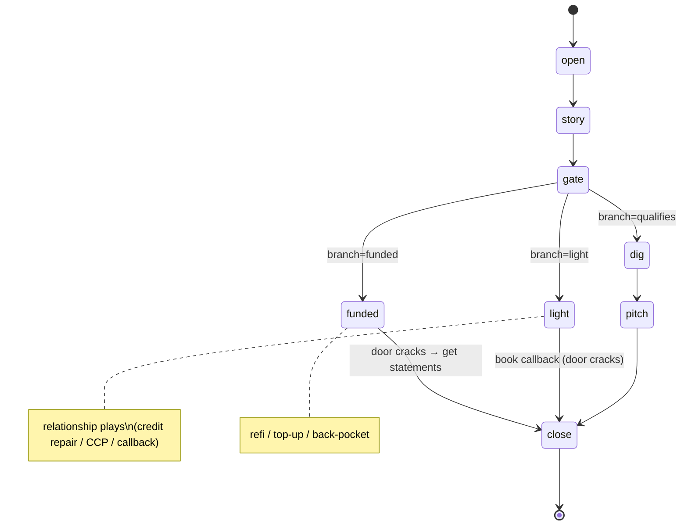

# GUIDED-FLOW — FinBiz Operator Console rebuild spec

> **Status:** design spec, no code written yet. **Owner:** UX Architect (AgentsNess).
> **Goal:** replace the 11-section scrolling reference with a **guided live-call flow** — compact, stage-by-stage, two-pane desktop, "show only what's relevant now," with the line-to-say always large+bold and objections always one reach away.
>
> **Hard rule for implementers:** all spoken/reference copy is **locked** in `src/content/*.ts`. This rebuild **reuses** that content verbatim — it re-maps it onto stages. Nothing in `src/content/*` or `src/types/content.ts` gets reworded. New code only *reads* it (plus one thin derived index module, `callScript.ts`, that references — not copies — existing fields).

---

## 1. Flow state model

### 1.1 Stages (the spine of a call)

| # | Stage id | Label (UI) | Purpose | Primary content source |
|---|----------|-----------|---------|------------------------|
| 0 | `open` | Open | Own it, set the frame, earn 5 min | `callFlow.beats[0]` (① Open) |
| 1 | `story` | Open the story | Get his goal in his words (paint it back later) | `callFlow.beats[1]` (② Open the story) |
| 2 | `gate` | Gate | Two numbers → branch decision | `callFlow.beats[2]` (③ Gate) + `triage.lanes` + `meta.ticker` |
| 3 | `dig` | Dig | Make the gap real, surface pain + payoff | `callFlow.beats[3]` (④ Dig) |
| 4 | `pitch` | Pitch | Point it + paint it, **product matrix woven in** | `callFlow.beats[4]` (⑤) + `products.products` / `products.pitches` |
| 5 | `close` | Close | Hard clean close + collect the file | `callFlow.beats[5]` (⑥) + `minimumFile.rows` |

Linear path is `open → story → gate → dig → pitch → close`. The **Gate** is the only branch point.

### 1.2 Gate branches (three live paths — no gatekeeper branch)

At `gate`, the rep picks the lane the two numbers land in. Branch state is independent of stage so the rep can flip it without losing position.

| Branch id | Trigger | Path after Gate | Content source |
|-----------|---------|-----------------|----------------|
| `qualifies` | Clears floor ($15K+/mo · 6+ mo · 500+) | Full `dig → risk → pitch → close` | main beats ④ ④.5 ⑤ ⑥; lane = `triage.lanes` (Floor / MCA hard gates) |
| `light` | Numbers light / below floor | **Light branch screen** → credit-repair / CCP / "two stronger months & callback" → optional `close` to book callback | `callFlow.branches[1]` ("↪ Light") + `products.products` where `relationshipPlay` (CCP, Credit Repair) + `products.relationshipNote` |
| `funded` | Already funded | **All-set branch screen** → refi for breathing room / halfway top-up / back-pocket → if door cracks, jump to `close` | `callFlow.branches[0]` ("↪ All set") + `products.products` "Renewal / Refi / Consol." + Renewal pitch `products.pitches[?]` |

> Branch terminology mapping (locked content uses different labels than the owner's brief — implementers must wire these aliases):
> - owner "Already funded" → `callFlow.branches[0]` titled *"↪ All set / already funded"* → branch id `funded`.
> - owner "Numbers light" → `callFlow.branches[1]` titled *"↪ Light"* → branch id `light`.

### 1.3 Transition diagram



All transitions are reversible (back/prev). Branch never auto-advances stage; it changes **what `dig`/`pitch`/`close` render** and reveals the dedicated branch screen.

### 1.4 State shape

Single source of truth, owned by `useCallFlow` (see §5). Mirror the existing `useNotes` localStorage pattern (key `finbiz.callflow.v1`), but session-only is acceptable for stage/branch.

```ts
type StageId = "open" | "story" | "gate" | "dig" | "pitch" | "close";
type BranchId = "qualifies" | "light" | "funded" | null; // null until Gate is resolved

interface CallFlowState {
  stage: StageId;            // current stage
  branch: BranchId;          // resolved at gate; drives dig/pitch/close + branch screens
  objectionsOpen: boolean;   // persistent panel collapsed/expanded (desktop: always visible; this toggles emphasis/focus)
  afterCallOpen: boolean;    // the "After the call" overlay/tab
  afterCallTab: "statements" | "qa" | "offer" | "pipeline" | null;
}

interface UseCallFlow extends CallFlowState {
  next(): void;              // advance along the active path
  back(): void;              // step back along the active path
  goTo(stage: StageId): void;// stepper click
  setBranch(b: BranchId): void; // hotkeys 1/2/3 at gate
  resetCall(): void;         // new call → open + branch null (also clears notes + timer if owner wants)
  toggleObjections(): void;
  openAfterCall(tab): void;
  closeAfterCall(): void;
  // derived
  path: StageId[];           // ["open","story","gate","dig","pitch","close"] or branch-adjusted
  canNext: boolean;
  canBack: boolean;
}
```

**Path resolution (derived, not stored):**
- `branch === "qualifies"` or `null` → `["open","story","gate","dig","pitch","close"]`
- `branch === "light"` → `["open","story","gate","light","close"]` (light screen replaces dig/pitch)
- `branch === "funded"` → `["open","story","gate","funded","close"]`

`next()`/`back()` walk `path`. The stepper always shows the **6 canonical stages**; light/funded render *inside* the position between Gate and Close (visually a sub-state, labeled on the stepper as "Branch").

### 1.5 Keyboard map (owned by `useKeyboardFlow`, guarded by `isTypingTarget` from `useSearch`)

| Key | Action | Notes |
|-----|--------|-------|
| `→` / `Space` | `next()` | advance stage along active path |
| `←` | `back()` | step back |
| `1` | `setBranch("qualifies")` | only meaningful at `gate`; elsewhere no-op |
| `2` | `setBranch("light")` | |
| `3` | `setBranch("funded")` | |
| `o` | `toggleObjections()` | jump focus into objections panel |
| `a` | `openAfterCall(last|"statements")` | toggle After-the-call overlay |
| `1–6` (with `g` prefix, optional) | `goTo(stage[n])` | stretch goal; not required for v1 |
| `/` | focus search | **existing** `CommandBar` behavior, unchanged |
| `Esc` | clear search / close After-call overlay | layered: overlay first, then search |

Reuse `isTypingTarget(e.target)` so the rep typing in Notes never triggers stage jumps. `Space` must `preventDefault` only when not in a typing target.

---

## 2. Per-screen spec

Layout per stage: **main pane (left)** = large bold line(s) + stage-contextual reference; **objections pane (right)** = always on; **branch controls** appear only at Gate / in branch screens.

Rendering rules:
- "Says" lines render via existing `Say` primitive but **scaled up** — see §3 typography. The *current* line is the hero; subsequent says in the beat render below at a smaller bold weight.
- Cues render via existing `Cue` primitive (muted, mono eyebrow) — coaching, never large.
- Text bubbles via existing `TextBubble`.

### Stage: `open`
- **Main — large bold:** `callFlow.beats[0].says[0..2]` (the three opener lines). First line is hero size.
- **Reference (sub):** `callFlow.rule` callout ("Let him talk ~60%…") rendered as a compact `Callout` strip at top of main pane (persists across all stages — see §3).
- **Objections pane:** full `objections.objections` list (most-common at top), each `q` → `reframe`. Always present.
- **Branch controls:** none.

### Stage: `story`
- **Main — large bold:** `callFlow.beats[1].says[0]` ("If money wasn't the bottleneck, what's the first move…").
- **Cue:** `callFlow.beats[1].cues[0]` ("Write it down word for word") — and surface a **one-tap "capture to Notes"** affordance writing into `useNotes` field `ifMoney`.
- **Objections pane:** unchanged.
- **Branch controls:** none.

### Stage: `gate`
- **Main — large bold:** `callFlow.beats[2].says[0]` ("what's the business doing a month… how long you been open?").
- **Reference (sub) — the lane decision board:** render `triage.lanes` (Green PUSH / Yellow REVIEW / Red WEAK) as three compact tone-coded cards (`go`/`amber`/`clay`), plus the floor numbers from `meta.ticker` (`$15K`, `6+ mo`, `500+`) as a thin chip row. `triage.rule` as a one-line footnote.
- **Branch controls (the live decision):** three large buttons, hotkey-labeled:
  - **`[1] Qualifies →`** (`setBranch("qualifies")`, advances to `dig`)
  - **`[2] Numbers light`** (`setBranch("light")`, advances to `light` screen)
  - **`[3] Already funded`** (`setBranch("funded")`, advances to `funded` screen)
  Use `triage.lanes[*].tone` for button color semantics (green/amber/clay). Map: qualifies→go, light→amber, funded→accent.
- **Capture-to-Notes:** revenue → `useNotes.revenue`, tenure → `useNotes.tenure`.
- **Objections pane:** unchanged (note: "I already have funding" objection sits here too — independent of the branch button).

### Stage: `dig` (branch = `qualifies`)
- **Main — large bold:** `callFlow.beats[3].says[0..4]` walked one at a time (next() can step *within* the beat lines, then to pitch — see §5 decision D2). Hero = current line.
- **Cue:** `callFlow.beats[3].cues[0]` ("He just handed you the pain AND the payoff… let it sit").
- **Capture-to-Notes:** pain → `useNotes.pain`.
- **Objections pane:** unchanged.

### Stage: `pitch` (branch = `qualifies`) — **product matrix woven in**
- **Main — large bold:** `callFlow.beats[4].says[0..2]` ("Here's what I'd put in front of you… Picture it… Depending on your numbers…").
- **Reference (sub) — woven product matrix:** a **compact, filterable** render of `products.products`. Default surfaces the **primary** (`MCA`, `primary: true`) plus the 1–2 fits implied by the file; the rep can expand to the full menu. For each shown product: `name`, `tag` (via `Tag`), `bestFit`, `terms`, `speed`, `sayIt`. The matching **pitch** line from `products.pitches` (the `say` + `cue`) renders as the ready-to-speak version.
  - Suppress `relationshipPlay` products (CCP, Credit Repair) here — `products.relationshipNote` says they never open; they live in the `light`/`funded` branches.
  - Footer: `products.rails` callout ("No guaranteed. No rate before the file…") — compliance, always visible in pitch.
- **Objections pane:** unchanged (esp. "What's your rate?", "Too expensive", "Bad credit").
- **Branch controls:** none.

### Stage: `close` (all qualifying + branch fallthrough)
- **Main — large bold:** `callFlow.beats[6].says[0..1]` ("send me your last three months of bank statements today… This your cell?").
- **Text bubbles:** `callFlow.beats[5].texts` rendered as `TextBubble`s, each with copy-to-clipboard.
- **Reference (sub) — what to collect (minimum file):** render `minimumFile.rows` filtered to the **Core — non-negotiable** subhead block as a tight checklist; conditional rows behind a "more" disclosure. Pull the light-first-text note `minimumFile.note` ("3 months of bank statements + the application") as the hero collect instruction. `minimumFile.callouts` (tax-returns caveat) as a footnote.
- **Capture-to-Notes:** nextStep → `useNotes.nextStep`.
- **Objections pane:** unchanged.

### Branch screen: `light` (between Gate and Close)
- **Main — large bold:** `callFlow.branches[1].says[0]` ("Straight with you — the numbers are a little light today… But I'm not writing you off.").
- **Cue / play menu:** `callFlow.branches[1].cues[0]` broken into the three plays: **credit repair** (60–90 days, never promise a score) · **CCP** (hold the line) · **"two stronger months & callback."** Surface the two `relationshipPlay` products from `products.products` (CCP, Credit Repair — `bestFit`/`sayIt`) and `products.relationshipNote`.
- **CTA:** "Book the callback" → advance to `close` (re-purposed as callback-booking; collect cadence into Notes). Optionally deep-link the matching `followUps` scenario ("Light / not yet") in After-call.
- **Objections pane:** unchanged.

### Branch screen: `funded` (between Gate and Close)
- **Main — large bold:** `callFlow.branches[0].says[0..2]` ("Glad you're moving. Who'd you go with… if those are daily pulls, I can probably refinance… the day you hit halfway, that's a top-up…").
- **Reference (sub):** the **Renewal / Refi / Consol.** product from `products.products` + its `products.pitches` "Renewal — the second swing" (`say`/`cue`).
- **Cue:** `callFlow.branches[0].cues[0]` ("If he cracks the door, you're back at ⑥. Get the statements.").
- **CTA:** "Door cracked → Close" → advance to `close`.
- **Objections pane:** unchanged ("I already have funding" reframe is right here).

### Always-on: Objections pane (every screen)
- **Source:** `objections.objections` (the `q`/`reframe`/`note` list) as the primary scannable list; most-common at top (content already ordered that way).
- **Secondary tabs inside the panel (collapsed by default):** `objections.dealKillers` (issue→move) and `objections.compliance` (dont→say). These are reference, kept one tap down so the live list stays clean.
- **Behavior:** hotkey `o` focuses the panel & opens a quick filter input (reuse the search idiom: type to filter `q` text). Clicking an objection expands its `reframe` large enough to read aloud.

---

## 3. Two-pane desktop layout (wireframe)

Target: desktop / big monitor. Use the width. Single screen, **no vertical page scroll** for the live view — each stage fits.

```
┌──────────────────────────────────────────────────────────────────────────────────┐
│ TOP BAR (h-14, sticky)   FinBiz·SDR    [ / search "what do I say?" ]   ⏱ 04:12 �+ │  ← search (existing CommandBar) + call timer (useCallTimer)
├──────────────────────────────────────────────────────────────────────────────────┤
│ STAGE STEPPER (h-16)                                                               │
│  ① Open ─ ② Story ─ ③ Gate ─[ Branch ]─ ④ Dig ─ ⑤ Pitch ─ ⑥ Close      [ New call ]│  ← clickable; active highlighted w/ accent-gradient bar
├───────────────────────────────────────────────┬──────────────────────────────────┤
│ MAIN STAGE PANE  (≈ 64% width, left)           │ OBJECTIONS PANE (≈ 36%, right)    │
│ ┌─ rule strip: "Let him talk ~60%…" ─────────┐ │  PERSISTENT  [ o ] filter…        │
│ │                                            │ │ ─────────────────────────────────│
│ │   ⑤ POINT IT + PAINT IT                    │ │ ▸ "What's your rate?"             │
│ │                                            │ │   Smart question — statements set │
│ │   ███ LARGE BOLD CURRENT LINE ███          │ │   the rate…                       │
│ │   "Here's what I'd put in front of you…"   │ │ ▸ "Too expensive."                │
│ │                                            │ │ ▸ "Bad credit."                   │
│ │   (next says, smaller bold)                │ │ ▸ "I already have funding."       │
│ │   cue · muted mono coaching                │ │ ▸ "Not interested."               │
│ │                                            │ │ ▸ "I don't need funding."         │
│ │ ── stage reference (contextual) ────────── │ │ ─────────────────────────────────│
│ │  [ MCA* ][ Term ][ LOC ]  ← product matrix │ │  ⌄ Deal killers   ⌄ Compliance    │
│ │  bestFit · terms · speed · sayIt           │ │     (collapsed reference tabs)    │
│ │  rails: No guaranteed · no rate before file│ │                                   │
│ └────────────────────────────────────────────┘ │                                   │
├───────────────────────────────────────────────┴──────────────────────────────────┤
│ FOOTER STRIP (h-12)  rails ticker · [ Notes ↑ ]            [ a  After the call ▸ ] │  ← Notes drawer (existing) + After-call toggle
└──────────────────────────────────────────────────────────────────────────────────┘

AFTER-THE-CALL OVERLAY (slides over from right / bottom sheet, dismiss = Esc):
┌──────────────────────────────────────────────────────────────────────────────────┐
│  AFTER THE CALL          [ Statements ] [ Final QA ] [ Approved Offer ] [ Pipeline ]│
│  ── selected tab body renders the existing section content (read-only) ────────────│
└──────────────────────────────────────────────────────────────────────────────────┘
```

- **Stage stepper:** horizontal, top. Active stage uses the existing `accent-gradient` bar idiom from `Sidebar`. The Branch slot shows the resolved branch (Qualifies/Light/Funded) once Gate is answered.
- **Main pane (left, ~64%):** rule strip (persistent thin `Callout`), hero line, secondary says, cue, then the **stage-contextual reference** block.
- **Objections pane (right, ~36%):** persistent. Never scrolls off. Hotkey `o`.
- **Search:** the existing `CommandBar` stays in the top bar, unchanged (`/` to focus). It now searches across the *currently mounted* stage + objections DOM, plus can be extended to jump-to-stage on hit (decision D3).
- **Notes + timer:** timer in top bar (new mount of existing `useCallTimer`); Notes drawer stays the existing `NotesDrawer`, triggered from footer. Capture-to-Notes affordances on Story/Gate/Dig/Close write straight into `useNotes` fields.
- **After-the-call:** overlay/drawer toggled by `a`, holding Statements / Final QA / Approved Offer / Pipeline as tabs — out of the live view entirely.

Responsive note (desktop-first per requirement): below `lg`, panes stack (objections becomes a bottom sheet toggled by `o`). Not the priority; ship desktop two-pane first.

---

## 4. Content mapping table (11 current sections → new home)

| # | Current section (`content/*.ts`) | New home | How it surfaces |
|---|-----------------------------------|----------|-----------------|
| 01 | Call Flow (`callFlow`) | **The spine** | `beats[0..5]` → stages Open/Story/Gate/Dig/Pitch/Close; `branches[0]`→`funded`, `branches[1]`→`light`; `rule`→persistent main-pane strip |
| 02 | Products (`products`) | **Woven into Pitch** (+ branch screens) | `products`/`pitches` in `pitch` reference; `relationshipPlay` (CCP, Credit Repair) in `light`; Renewal in `funded`; `rails` shown in Pitch |
| 03 | MCA Structure (`mca`) | **After the call** (rep education) + 1-line in Pitch | Full structure in After-call (it's NOT quoted live, per its own header). The live "factor ≠ APR" rail comes from `meta.rails` + `products.pitches` MCA cue |
| 04 | Triage & Lanes (`triage`) | **Gate** | `lanes` → 3 lane cards; `rule` → footnote; drives branch-button color semantics |
| 05 | Statement Read (`statements`) | **After the call** | "Reading the statements" tab — used post-call when reviewing the file |
| 06 | Minimum File (`minimumFile`) | **Close** | Core rows = collect checklist; `note` = first-text hero; conditional rows behind disclosure |
| 07 | Pipeline (`pipeline`) | **After the call** | Pipeline tab (file-management view, not live). `questions` (discovery 1–9) optionally surfaced as a Gate/Dig reference disclosure |
| 08 | Objections (`objections`) | **Always-on right pane** | `objections` = live list; `dealKillers` + `compliance` = collapsed reference tabs in the same pane |
| 09 | Follow-Ups (`followUps`) | **After the call** (deep-linked from branches) | SMS templates; Light/Funded/Close branches deep-link the matching scenario |
| 10 | Final QA (`finalQa`) | **After the call** | Pre-submission checklist tab |
| 11 | Approved Offer (`offer`) | **After the call** | Approved-Offer desk tab; its `gate` callout ("after approval only") stays — keeps it out of the live cold-call view |

Net: **live view = sections 01 + 04 (Gate) + 06 (Close) + 02 (Pitch) + 08 (always-on).** Everything else moves to After-the-call. This is the compaction.

---

## 5. Component & file architecture plan

New top-level feature folder: **`src/features/callflow/`**. Clear file ownership so implementers build in parallel without collisions. Existing `src/content/*`, `src/types/content.ts`, `src/features/notes/*`, `src/features/search/*`, and `src/components/ui/*` are **read/reuse only** for this work.

### 5.1 State & data (owner A)

| File | Responsibility | Reads | Exports |
|------|----------------|-------|---------|
| `src/features/callflow/useCallFlow.ts` | The state machine (§1.4). Stage/branch/path/transitions. | nothing (pure state) | `useCallFlow()`, `StageId`, `BranchId`, `CallFlowState` |
| `src/features/callflow/useKeyboardFlow.ts` | Binds the keyboard map (§1.5) to a `useCallFlow` instance. Guards with `isTypingTarget`. | `useSearch`'s `isTypingTarget` | `useKeyboardFlow(flow)` |
| `src/features/callflow/callScript.ts` | **Thin derived index** — maps each `StageId`/`BranchId` to the exact content references (which beat, which lanes, which products, which minimumFile rows). Single place implementers look up "what content does this stage show." **References fields; does not copy text.** | `callFlow`, `triage`, `products`, `minimumFile`, `objections` | `STAGE_CONTENT: Record<StageId, StageContentRef>`, `BRANCH_CONTENT`, helper selectors (`pitchProducts()`, `coreFileRows()`, `relationshipProducts()`) |
| `src/features/callflow/types.ts` | Shared TS types for the feature (`StageContentRef`, panel props). | `@/types/content` | types |

> `callScript.ts` is the contract module — it is the *only* place the new feature reaches into `src/content`. Every panel imports its slice from here, not from `content/*` directly. This isolates the locked-content coupling to one file.

### 5.2 Layout (owner B)

| File | Responsibility | Reads | Props |
|------|----------------|-------|-------|
| `src/features/callflow/CallConsole.tsx` | New root. Replaces `Shell` as the app entry view. Holds `useCallFlow` + `useKeyboardFlow`, lays out top bar / stepper / two panes / footer / after-call overlay. | `useCallFlow`, `useCallTimer`, `CommandBar` | none (top-level) |
| `src/features/callflow/StageStepper.tsx` | Horizontal clickable stepper; shows 6 stages + resolved branch slot; active highlight via `accent-gradient`. | — | `{ path, stage, branch, onGoTo }` |
| `src/features/callflow/TopBar.tsx` | Brand + mounts existing `CommandBar` + `CallTimer` display/controls. | `brand` (meta), `useCallTimer` | — |
| `src/features/callflow/FooterStrip.tsx` | `meta.rails` ticker + Notes trigger + After-call toggle. | `rails` (meta) | `{ onOpenNotes, onOpenAfterCall }` |

### 5.3 Panels (owner C — can split per panel)

| File | Responsibility | Reads (via `callScript`) | Props |
|------|----------------|--------------------------|-------|
| `src/features/callflow/StagePanel.tsx` | The left main pane. Switches on `stage`+`branch`, renders hero line(s) + cue + the stage-contextual reference slot. Uses `Say`/`Cue`/`TextBubble`/`Callout`. | `STAGE_CONTENT[stage]` | `{ stage, branch, onCaptureNote }` |
| `src/features/callflow/StageReference.tsx` | The contextual reference block inside StagePanel: lane cards (Gate), product matrix (Pitch), collect checklist (Close), relationship plays (Light), renewal (Funded). | `triage.lanes`, `products`, `minimumFile` via selectors | `{ stage, branch }` |
| `src/features/callflow/GateBranchControls.tsx` | The three branch buttons + lane-tinted styling + hotkey labels. | `triage` tones | `{ onSetBranch }` |
| `src/features/callflow/ObjectionsPanel.tsx` | The always-on right pane. Live list + filter + collapsed dealKillers/compliance tabs. | `objections.*` | `{ open, onToggle }` |
| `src/features/callflow/AfterCallPanel.tsx` | The overlay with tabs (Statements / Final QA / Approved Offer / Pipeline / MCA). Renders existing section components (read-only) or thin re-renders of their content. | `statements`, `finalQa`, `offer`, `pipeline`, `mca`, `followUps` | `{ open, tab, onSelectTab, onClose }` |
| `src/features/callflow/LineHero.tsx` | The LARGE+BOLD current-line renderer (typography contract, §6). Used by StagePanel for the hero say. | — | `{ text, size?: "hero" \| "secondary" }` |

### 5.4 Reused as-is (no edits)
- `src/components/ui/*` — `Say`, `Cue`, `TextBubble`, `Callout`, `Tag`, `Card`, `DataTable`, `StatBlock`. (Beat-level `Say` gets a larger size variant — add a `size` prop in a follow-up, or wrap with `LineHero`. Prefer `LineHero` wrapper to avoid touching the primitive.)
- `src/features/search/*` — `CommandBar`, `useSearch`, `isTypingTarget`.
- `src/features/notes/*` — `useNotes`, `NotesDrawer`, `useCallTimer`. The capture-to-Notes affordances call `useNotes.setField`.
- All of `src/content/*` and `src/types/content.ts`.

### 5.5 Wiring change (owner B, last)
- `src/App.tsx` (or wherever `Shell` mounts): swap `<Shell>{sections}</Shell>` for `<CallConsole />`. The 11 `sections/*` components are no longer mounted in the live view; `AfterCallPanel` mounts the 5 that survive (Statements, Final QA, Offer, Pipeline, MCA) on demand.

### Parallelization
Owner A (state/data) ships `useCallFlow` + `callScript.ts` first (everyone depends on it; stub it early). Owners B (layout) and C (panels) build against the `callScript` contract and `useCallFlow` interface in parallel. No two owners write the same file.

---

## 6. Typography / motion contract (the "LARGE & BOLD line")

Stays within the existing Minimalist Modern system (`tailwind.config.ts`, `index.css`).
- **Hero current line (`LineHero size="hero"`):** `font-display` is reserved for headlines; spoken lines use **`font-sans` weight 700, clamp ~`text-3xl`→`text-5xl`** (`clamp(1.875rem, 2.2vw + 1rem, 3rem)`), tight leading, max-w ~38ch for readability at a glance. High-contrast `text-foreground`.
- **Secondary says:** `font-sans` 600, `text-xl`.
- **Cues:** existing `Cue` (mono eyebrow + muted) — unchanged, never large.
- **Transitions:** stage change = a single `fade-in-up` (existing keyframe), short (≤200ms), respecting `prefers-reduced-motion`. No decorative float/spin in the live view (those stay in marketing-style surfaces only — cut from console).
- **Lane/branch colors:** `go` / `amber` / `clay` tokens (already defined). Accent gradient only on stepper active + primary CTA.

---

## 7. What gets simpler / cut (the compaction)

- **`Shell` + `Masthead` + scrolling stack are replaced.** No more `space-y-16` 11-section vertical scroll; no scroll-spy `Sidebar`. The console is one non-scrolling screen per stage.
- **`Sidebar` (scroll-spy index rail) → `StageStepper`** (6 stages, horizontal, top). The 11-item nav (`meta.nav`) is no longer the navigation model; it survives only as the After-call tab order for the 5 surviving sections.
- **`Masthead` hero/tagline cut** from the live view (it's onboarding chrome, not call-time). Brand collapses to a small mark in `TopBar`.
- **5 of 11 sections leave the live view entirely** (MCA, Statements, Pipeline, Final QA, Approved Offer → After-call). They're never needed mid-cold-call.
- **Product matrix stops being a standalone section** — it's surfaced contextually only in Pitch (and the relevant slices in branches).
- **Decorative motion** (float/spin/glow keyframes) cut from console surfaces — speed + legibility over flourish.
- Net live-view content: ~4 sections of copy on screen at once instead of 11 stacked.

---

## 8. Open risks / decisions for the orchestrator

- **D1 — line-by-line stepping vs beat-at-a-time.** Some beats have 3–5 `says` lines (Dig has 5). Decision: does `next()` step through each line as its own hero, or show all the beat's lines at once with the top one as hero? **Recommendation:** step line-by-line within multi-line beats (`next()` advances the in-beat cursor, then to the next stage). Needs a sub-cursor in `useCallFlow` (`lineIndex`). Confirm with owner.
- **D2 — branch reversibility after Close.** If the rep mis-laned at Gate, switching branch mid-`dig` should be allowed (`setBranch` from any stage re-resolves path). Confirm this is desired vs locking branch once past Gate.
- **D3 — search scope.** Should `/` search also jump across stages (find a line in Pitch while you're in Open)? Current `CommandBar` searches mounted DOM only; if stages unmount, cross-stage search needs a content-index search (search `callScript`/content data, then `goTo` the stage). **Recommendation:** add a lightweight data-index search that navigates to the stage on hit. Scope decision.
- **D4 — `Say` primitive size.** Prefer wrapping in `LineHero` (no primitive edit) vs adding a `size` prop to `Say`. **Recommendation:** `LineHero` wrapper to keep `src/components/ui` untouched per the locked-content spirit.
- **D5 — capture-to-Notes vs auto-advance.** Should resolving the Gate auto-fill revenue/tenure from a quick input, or is Notes purely manual? **Recommendation:** manual one-tap capture buttons (no forced data entry mid-call).
- **D6 — persistence.** Persist stage/branch across reload (like Notes) or reset every load? **Recommendation:** session-only for stage/branch; `resetCall()` on "New call." Notes + timer keep their existing persistence.
- **D7 — discovery questions (`pipeline.questions`).** They overlap the Gate/Dig. Surface them as a Gate reference disclosure, or keep purely in After-call Pipeline? Owner call.
```
